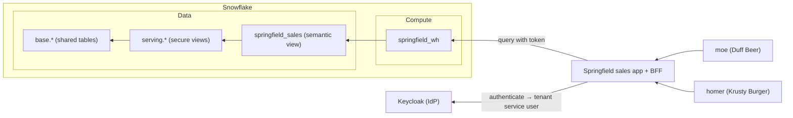

# Walkthrough

## Situation

Duff Beer and Krusty Burger share a multi-tenant sales application in this
Simpsons-themed demo. The web application runs outside Snowflake and embeds a
Streamlit in Snowflake app, backed by Cortex Analyst, so Moe and Homer can ask
questions of their own tenant's sales data in natural language. Both businesses
use the same application, but neither can see the other's data.

Every tenant's data lives in the same physical tables. Isolation is enforced
inside Snowflake by secure views that join an entitlements table on
`CURRENT_ROLE()`, so a tenant cannot see another tenant's rows regardless of
what the application or the question asks for. A tenant's individual staff are
never provisioned as Snowflake users: they authenticate at the identity provider
and resolve to their tenant's single Snowflake service account.



## Objectives

In following the `justfile` recipes, you'll:

1. **Bootstrap** the multitenant sales data model and prove its isolation.
2. **Run** a local identity provider.
3. **Provision** an OAuth connection in Snowflake.
4. **Add** one user per tenant.
5. **Log in** as each user, seeing only the data their tenant allows.

All of this - aside from what's inside of Snowflake - will run on your local
machine.

## Execution

### 1. Prerequisites

With the tools from the repo's [Requirements](../README.md#requirements)
installed, configure your environment.

#### 1.1 Copy the `.env.example`

To begin, copy `.env.example` from the repository root:

```sh
cp .env.example .env
```

#### 1.2 Configure ngrok

The repo uses ngrok to tunnel your locally-running **IdP service** to Snowflake.
[Provision a static
domain](https://ngrok.com/blog/free-static-domains-ngrok-users#find-your-dev-domain)
and grab your auth token from the ngrok dashboard, then set both in the `.env`:

```plaintext
NGROK_AUTHTOKEN=2abc...
KEYCLOAK_PUBLIC_URL=https://<your_domain>.ngrok.app
```

Your domain serves the public URL of your IdP later, hence the key name in the
`.env`.

#### 1.3 Add your Snowflake identifier

Also set `SNOWFLAKE_HOST` in the `.env` (e.g.
`abcd-xy12345.snowflakecomputing.com`); the app containers use it to reach the
Snowflake SQL API.

### 2. Bootstrap

With the `.env` in place, point the `setup` recipe at your Snow CLI connection -
the same name you'd pass to `snow sql -c`, which you can list with `snow
connection list`:

```sh
just setup <connection>
```

That runs the migrations in order, then deploys the Streamlit app:

- **`001_init.sql`** — creates the `springfield_admin` role and grants it to
`CURRENT_USER()`. This role owns the data model.
- **`002_objects.sql`** — creates the `springfield_db` database, the shared `springfield_wh`
warehouse, and two schemas: `base` (raw tables and entitlements) and `serving`
(the secure views we expose). All tenants share these objects.
- **`003_data.sql`** — creates the sales model shared by all tenants: one
`base.sales` table clustered by `(tenant_id, sale_ts)` so tenant-scoped queries
prune the other tenants' micro-partitions. Seeds rows for both tenants, then
adds:
  - `base.entitlements`, mapping each **role** to a **tenant_id**.
  - a `serving.sales` secure view joining entitlements on `WHERE e.role_name =
  CURRENT_ROLE()`. Row isolation keys off the querying role.
- **`004_tenants.sql`** — creates one role per tenant (`tenant_duff`,
`tenant_krusty`) and one `TYPE = SERVICE` user per tenant (`TENANT_DUFF_SVC`,
`TENANT_KRUSTY_SVC`), grants each tenant's role to its service user as that
user's `DEFAULT_ROLE`, and grants both roles identical access to the serving
schema and warehouse — never `base`. It also grants both tenant roles to whoever
ran the migration, purely so `just verify` can assume each role locally.
- **`007_semantic_view.sql`** — the `springfield_sales` semantic view over
`serving.sales`, which Cortex Analyst reads to generate tenant-scoped SQL.
- **`snow streamlit deploy`** — deploys the container-runtime Streamlit app from
`app/` (using `app/snowflake.yml`), uploading `streamlit_app.py` and
`pyproject.toml` as stage artifacts. This can't be a plain SQL migration, so the
`setup` recipe runs it here.
- **`008_streamlit.sql`** — attaches the built-in PyPI mirror artifact
repository (`snowflake.snowpark.pypi_shared_repository`) to the app so the
container can install its dependencies without external egress, and grants each
tenant role USAGE on the app so `SYSTEM$STREAMLIT_GENERATE_EMBED_URL` resolves
and the iframe session can open it.

The split: one service account per tenant, one role per tenant. No Snowflake
identity is provisioned for a tenant's individual staff.

### 2.1 Verify isolation

Before anything else runs, prove the data layer holds on its own:

```sh
just verify <connection>
```

This assumes each tenant role in turn and checks that it sees only its own rows,
that naming the other tenant returns nothing, and that `base` is unreachable. It
disables secondary roles first, which is not incidental — an operator holds
other roles, and with secondary roles active a check against `base` measures the
operator's privileges rather than the tenant role's. The last check is expected
to fail with a privilege error naming `SPRINGFIELD_DB.BASE`; that failure is the pass
condition.

### 3. Run the IdP

Start Keycloak and the ngrok tunnel:

```sh
just idp-up
```

This starts both containers and waits ~20 seconds. ngrok publishes Keycloak at
your `KEYCLOAK_PUBLIC_URL`, giving Snowflake a public issuer URL to fetch
signing keys from — it can't reach `localhost`.

Then seed the realm and the machine clients:

```sh
just idp-seed
```

`idp-seed` creates the `tenants` realm and one confidential service-account
client per tenant (`tenant-duff`, `tenant-krusty`). Protocol mappers stamp three
claims onto each token: `aud` = `snowflake`, `snowflake_user` (the tenant's
service user), and `scp` = `session:role:<ROLE>` (the role to activate). Client
IDs and secrets land in `auth/clients.json`. Human logins come in step 5.

### 4. Provision OAuth in Snowflake

Now teach Snowflake to trust tokens minted by that realm:

```sh
just oauth-add <connection>
```

The recipe substitutes your `KEYCLOAK_PUBLIC_URL` into `005_oauth.sql` and runs
it, creating the `EXTERNAL_OAUTH` security integration `springfield_keycloak`. Two
mappings matter:

- `EXTERNAL_OAUTH_TOKEN_USER_MAPPING_CLAIM = 'snowflake_user'` → `LOGIN_NAME`:
the `snowflake_user` claim resolves the token to a Snowflake login (e.g.
`TENANT_DUFF_SVC`).
- `EXTERNAL_OAUTH_SCOPE_MAPPING_ATTRIBUTE = 'scp'`: the `scp` claim selects the
active role. With one role per tenant this always names that tenant's single
role, which is also the service user's `DEFAULT_ROLE`. The mapping is kept so
that adding access levels within a tenant later needs no change to the
integration.

The integration points at the tunnel's JWS keys URL, so Snowflake auto-refreshes
Keycloak's signing keys through rotation.

**Order matters:** this step must run *after* `idp-seed` (step 3), which creates
the `tenants` realm and its signing keys. If you provision the integration
before the realm exists, Snowflake caches a missing/stale key set and every
login fails with `390303 Invalid OAuth access token`. Because `just teardown`
wipes Keycloak's volume, its keys are regenerated on each rebuild — so re-run
`oauth-add` after `idp-seed` every time, not before. (`just bootstrap
<connection>` runs the whole sequence in the correct order.)

### 5. Seed users

```sh
just idp-add-users
```

This creates the `springfield-web` confidential client — the web app's
authorization-code (PKCE) login — writing its secret to `auth/web.env`, then
creates one user per tenant:

| Username | Password    | Tenant        | Resolves to         | Role            |
|----------|-------------|---------------|---------------------|-----------------|
| `moe`    | `duff123`   | Duff Beer     | `TENANT_DUFF_SVC`   | `TENANT_DUFF`   |
| `homer`  | `krusty123` | Krusty Burger | `TENANT_KRUSTY_SVC` | `TENANT_KRUSTY` |

Each user carries `snowflake_user` and `scp` as attributes, so their tokens
assert the same claims as the service-account clients. This is the pattern that
matters for a managed multi-tenant app: a tenant's staff authenticate as
themselves at the IdP and resolve to their tenant's single Snowflake service
identity, so no Snowflake user is provisioned per end user.

### 6. Log in

Build and start the API (a small BFF) and the web app:

```sh
just app-up
```

Open **http://localhost:8000**, click **Sign in**, and log in as either user.
The app shows:

1. **Token asserts** — the `snowflake_user`, `scp`, and `aud` claims from the
   access token.
2. **Snowflake resolved** — `CURRENT_USER()` and `CURRENT_ROLE()`.
3. **Sales data** — a query over the `serving` secure views.

Compare across users:

- **moe** resolves to `TENANT_DUFF_SVC` running as `TENANT_DUFF`, and sees only
Duff Beer sales.
- **homer** resolves to `TENANT_KRUSTY_SVC` running as `TENANT_KRUSTY`, and sees
only Krusty Burger sales.

Shared tables, shared views, disjoint results. Sign out (which also ends the
Keycloak SSO session) before switching users, or use a second browser profile to
hold both sessions at once.

The sharper version of this comparison is to ask both users the same question
through Cortex Analyst. "What is total revenue by region?" produces one
generated query, and each tenant sees only its own regional totals. See
`tests/analyst_questions.md`.

### 7. Clean up

#### Temporary

Stop the local stack, keeping the Keycloak volume and Snowflake objects:

```sh
docker compose down
```

Resume later with `just idp-up` and `just app-up`.

#### Permanent

Tear down local volumes and the Snowflake data model:

```sh
just teardown <connection>
```

This runs `docker compose down -v` and `teardown.sql`, dropping the database,
warehouse, both tenant roles, both service users, `springfield_admin`, and the
`springfield_keycloak` integration. The generated `auth/clients.json` and `auth/web.env`
remain on disk; remove them for a clean slate:

```sh
rm -f auth/clients.json auth/web.env
```
